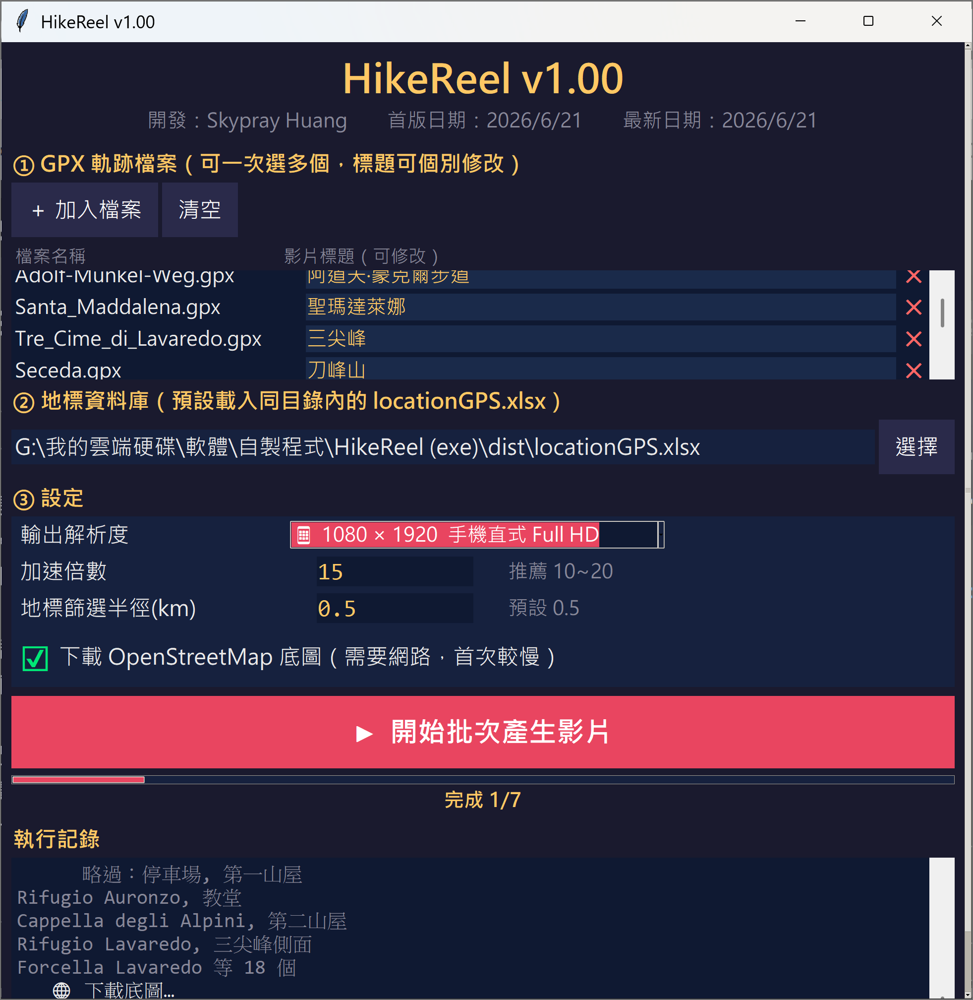
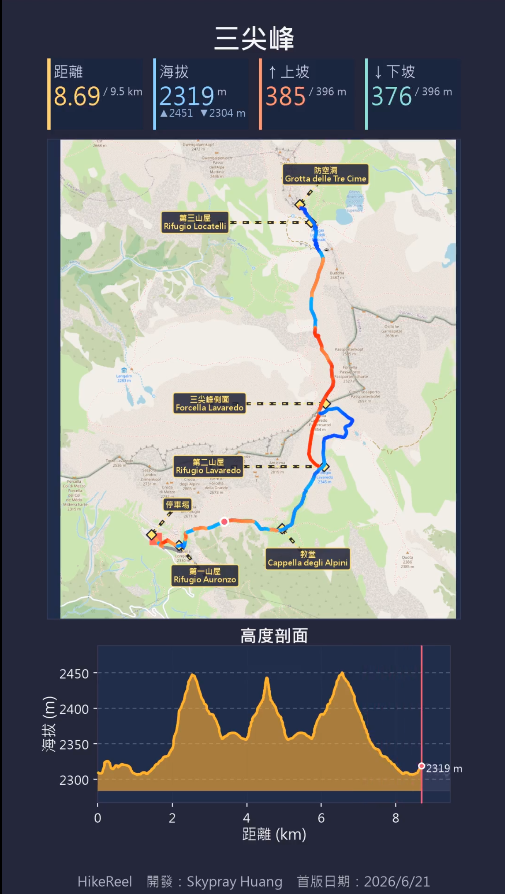
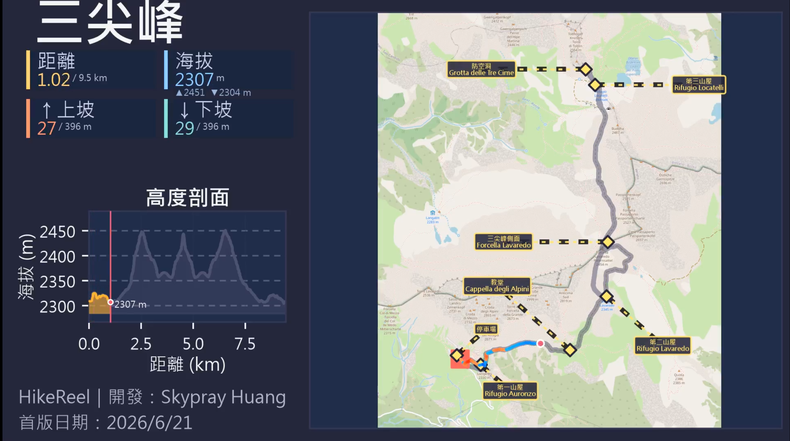

# HikeReel v1.00

**HikeReel** 是一個將 GPX 健行軌跡轉換成動態影片的工具，適合上傳至 YouTube Shorts 或 Instagram Reels。

## ⬇️ 下載執行檔（Windows）

> 不需要安裝 Python，下載即用。

**[➡️ 前往下載頁面（Releases）](https://github.com/skypray73/HikeReel/releases/latest)**

下載內容：
- `HikeReel.exe` — 主程式（Windows 64位元）
- `locationGPS.xlsx` — 地標資料庫範本

> 建議同時下載 ffmpeg（見下方說明），以獲得最佳影片品質。

---

## 截圖

### GUI 介面


### 直式輸出（手機 / YouTube Shorts）


### 橫式輸出（電腦 / YouTube）


---

## 功能特色

- 📍 自動下載 OpenStreetMap 底圖
- 🎨 路線以坡度上色（上坡橘紅、下坡藍青）
- 📊 動態儀表板：距離 / 海拔 / 累積上坡 / 累積下坡
- 🏔️ 高度剖面圖（含自動間距虛線）
- 🗺️ 支援自訂地標標籤（locationGPS.xlsx）
- 🎬 支援多種解析度（720p / 1080p / 2K / 4K，直式 / 橫式）
- ⚡ GPU 加速（需安裝 ffmpeg + NVIDIA）
- 🖥️ GUI 視窗介面，支援批次處理多個 GPX
- 📱 直式佈局符合 YouTube Shorts 安全邊界

---

## 如何取得 GPX 軌跡檔案

推薦使用 **[gpx.studio](https://gpx.studio/)** 線上繪製健行路線並匯出 GPX。

### 使用 gpx.studio 的步驟

1. 開啟 https://gpx.studio/
2. 在地圖上點擊起點，沿路線依序點擊各個路徑點
3. 完成後點右上角「**Export**」→ 選「**GPX**」格式下載
4. 把下載的 `.gpx` 檔案拖入 HikeReel 即可

> 也可以直接把健行 App（Strava、Garmin Connect、Komoot 等）匯出的 GPX 拖入使用。

---

## 範例 GPX

`examples/` 資料夾內有示範用的 GPX 檔案，可直接拖入 HikeReel 試用：

| 檔案 | 路線 | 地點 | 距離 | 海拔範圍 | 爬升 |
|---|---|---|---|---|---|
| Tre_Cime_di_Lavaredo.gpx | 三尖峰環線 | 義大利 南提洛 | 9.5 km | 2302～2453 m | 526 m |
| Adolf-Munkel-Weg.gpx | 阿道夫蒙克爾步道 | 義大利 南提洛 | 5.4 km | 1672～1943 m | 310 m |
| Alpe_di_Siusi.gpx | 西西爾高原 | 義大利 南提洛 | 3.4 km | 1848～2012 m | 66 m |
| Lago_di_Braies.gpx | 布萊埃斯湖環湖 | 義大利 南提洛 | 3.7 km | 1492～1534 m | 137 m |
| Resciesa.gpx | 雷奇沙山 | 義大利 南提洛 | 5.1 km | 2098～2280 m | 205 m |
| Santa_Maddalena.gpx | 聖瑪達萊納 | 義大利 南提洛 | 3.8 km | 1234～1349 m | 220 m |
| Seceda.gpx | 塞切達山 | 義大利 南提洛 | 2.3 km | 2440～2517 m | 104 m |
| 玉山主峰.gpx | 玉山主峰 | 台灣 南投 | 10.1 km | 2598～3927 m | 2106 m |
| 高雄壽山_好漢亭.gpx | 壽山好漢亭 | 台灣 高雄 | 2.1 km | 71～298 m | 245 m |

---

## 系統需求

- Windows 10/11
- Python 3.11+（直接下載 exe 則不需要）
- ffmpeg（選用，強烈建議安裝）

---

## 安裝套件（從原始碼執行）

```
pip install gpxpy matplotlib numpy opencv-python pillow contextily pyproj rasterio mercantile xyzservices certifi openpyxl
```

---

## 使用方式

### GUI 模式（推薦）

```
python gpx_video_app.py
```

1. 點「＋ 加入檔案」選擇 GPX 檔案（可多選）
2. 修改每個檔案的影片標題
3. 選擇地標資料庫（locationGPS.xlsx）
4. 設定解析度、加速倍數
5. 點「▶ 開始批次產生影片」

### 命令列模式

```
python gpx_to_video.py your_track.gpx --title "路線名稱" --speed 15
```

| 參數 | 說明 | 預設值 |
|---|---|---|
| `--title` | 影片標題 | GPX 檔名 |
| `--speed` | 加速倍數 | 15 |
| `--width` / `--height` | 解析度 | 720 / 1280 |
| `--landmarks` | 地標資料庫路徑 | - |
| `--radius` | 地標篩選半徑 (km) | 0.5 |
| `--no-basemap` | 不下載底圖 | - |
| `--no-gpu` | 不使用 GPU | - |

---

## 地標資料庫格式（locationGPS.xlsx）

| 名稱 | 座標 | 路線標籤 | 備註 |
|---|---|---|---|
| 第一山屋\nRifugio Auronzo | 46.61232, 12.29588 | Tre Cime | 海拔 2333m |

- 座標格式：`緯度, 經度`（直接從 Google Maps 右鍵複製）
- 名稱可用 `\n` 換行（中文在上、外文在下）
- `locationGPS.xlsx` 放在 exe 同一資料夾，程式啟動時自動載入

---

## ffmpeg 安裝（強烈建議）

### 為什麼需要 ffmpeg？

| | 有 ffmpeg | 沒有 ffmpeg |
|---|---|---|
| 影片品質 | ⭐⭐⭐ H.264，各平台通用 | ⭐ mp4v，部分裝置可能無法播放 |
| 速度 | 快（支援 NVIDIA GPU 加速） | 較慢 |
| YouTube / IG 相容性 | ✅ 完全相容 | ⚠️ 部分平台可能拒絕上傳 |

### 安裝方式

**方式 A：用 winget 安裝（推薦）**

```
winget install Gyan.FFmpeg
```

**方式 B：手動下載**

1. 到 https://www.gyan.dev/ffmpeg/builds/ 下載 `ffmpeg-release-essentials.zip`
2. 解壓縮，找到 `bin\ffmpeg.exe`
3. 把 `ffmpeg.exe` 複製到和 `HikeReel.exe` 同一個資料夾

### 確認安裝成功

```
ffmpeg -version
```

---

## 解析度選項

| 選項 | 用途 |
|---|---|
| 720 × 1280 | 手機直式 HD（YouTube Shorts）|
| 1080 × 1920 | 手機直式 Full HD |
| 1440 × 2560 | 手機直式 2K |
| 2160 × 3840 | 手機直式 4K |
| 810 × 1440 | 平板直式 |
| 1280 × 720 | 電腦橫式 HD |
| 1920 × 1080 | 電腦橫式 Full HD |
| 2560 × 1440 | 電腦橫式 2K |
| 3840 × 2160 | 電腦橫式 4K |

---

## 打包成 .exe

請參閱 `打包說明.txt`

---

## 開發者

**Skypray Huang**　首版日期：2026/6/21

## 授權

MIT License
